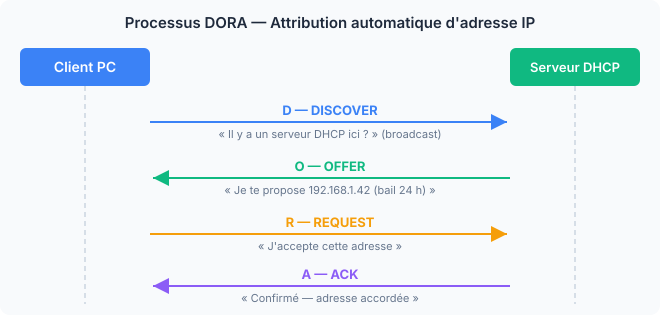
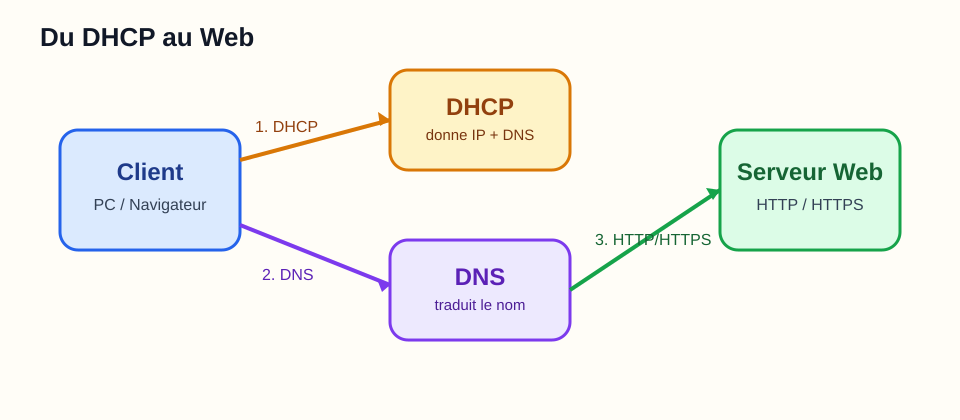

# Chapitre 6 — Services réseau essentiels

Après les couches basses (physique, liaison, réseau, transport), on peut enfin voir ce qui rend un réseau **utile au quotidien**. Ce sont les services qui permettent à un poste d'obtenir une configuration, de trouver un serveur et de dialoguer avec lui.

Dans ce chapitre, on se concentre sur les services qu'un débutant rencontre tout de suite : **DHCP**, **DNS**, **HTTP/HTTPS**, puis un aperçu des protocoles applicatifs classiques.

---

## 6.1 Présentation et Session : rappel rapide

Dans le modèle OSI :
- la **couche 5** gère la continuité du dialogue,
- la **couche 6** gère le format, la compression et le chiffrement,
- la **couche 7** porte les protocoles visibles par l'utilisateur.

En pratique, dans beaucoup de cours et dans le modèle TCP/IP, ces trois couches sont souvent regroupées sous le terme **couche Application**.

### Exemple concret : HTTPS

Quand tu ouvres un site en HTTPS :
- **HTTP** formule la requête web,
- **TLS** chiffre l'échange,
- la session permet de garder un dialogue cohérent entre navigateur et serveur.

```
Navigateur → HTTP → TLS → TCP → IP → Ethernet → signal
```

---

## 6.2 DHCP — Attribution automatique d'une configuration IP

<iframe width="560" height="315" src="https://www.youtube.com/embed/yH9UvkeAz-I?si=RToBx2HcZQl-35zg" title="YouTube video player" frameborder="0" allowfullscreen></iframe>

**DHCP** (*Dynamic Host Configuration Protocol*) attribue automatiquement à chaque appareil :
- une adresse IP,
- le masque,
- la passerelle par défaut,
- les serveurs DNS,
- une durée de bail.

### Processus DORA

```
Client  →  DISCOVER  →  broadcast
Client  ←  OFFER     ←  serveur DHCP
Client  →  REQUEST   →  serveur DHCP
Client  ←  ACK       ←  serveur DHCP
```





> [!info]
> Si aucun serveur DHCP ne répond, un poste Windows peut s'attribuer une adresse **APIPA** en `169.254.x.x`. On peut alors parfois communiquer localement, mais pas sortir vers Internet.

---

## 6.3 DNS — Résolution de noms

<iframe width="560" height="315" src="https://www.youtube.com/embed/qzWdzAvfBoo?si=DHf9vBPBi0BpvlW0" title="YouTube video player" frameborder="0" allowfullscreen></iframe>

Le **DNS** (*Domain Name System*) traduit un **nom de domaine** en **adresse IP**.

Exemple :
- humain : `www.example.com`
- machine : `93.184.216.34`

### Fonctionnement

1. L'utilisateur saisit un nom.
2. Le poste interroge son **serveur DNS**.
3. Le serveur répond avec l'adresse IP.
4. La connexion peut commencer.


### Enregistrements à connaître

|Type|Rôle|Exemple|
|---|---|---|
|**A**|Nom vers IPv4|`example.com → 93.184.216.34`|
|**AAAA**|Nom vers IPv6|`example.com → 2606:2800::1`|
|**MX**|Serveur mail|`mail.example.com`|
|**CNAME**|Alias|`www → example.com`|
|**PTR**|IP vers nom|`93.184.216.34 → example.com`|

### Hiérarchie simplifiée

```
Serveurs racine
   → TLD (.fr, .com, .org)
      → serveur autoritaire du domaine
         → réponse au serveur récursif
```

```bash
nslookup google.com
dig google.com
dig -x 8.8.8.8
```

---

## 6.4 HTTP et HTTPS — Le web en pratique

<iframe width="560" height="315" src="https://www.youtube.com/embed/WGdOWtKL5nA?si=nTf1mIx7M3n4Fs2w" title="YouTube video player" frameborder="0" allow="accelerometer; autoplay; clipboard-write; encrypted-media; gyroscope; picture-in-picture; web-share" referrerpolicy="strict-origin-when-cross-origin" allowfullscreen></iframe>

Une fois le nom résolu, le navigateur peut contacter le serveur web.

### HTTP

HTTP suit une logique **requête / réponse** :

```http
GET / HTTP/1.1
Host: example.com
```

Le serveur répond par exemple avec :

```http
HTTP/1.1 200 OK
```

### Codes à connaître

|Code|Signification|
|---|---|
|`200`|Succès|
|`301`|Redirection|
|`404`|Page introuvable|
|`500`|Erreur serveur|

### HTTPS

**HTTPS** = **HTTP + TLS**

Le rôle de TLS est de :
- chiffrer les échanges,
- authentifier le serveur par certificat,
- protéger l'intégrité des données.

> [!warning]
> Sur un réseau non fiable, HTTP en clair est lisible. HTTPS est devenu la norme pour protéger les échanges web.

---

## 6.5 Autres protocoles applicatifs utiles

|Protocole|Rôle|Port courant|
|---|---|---|
|**SMTP**|Envoi d'e-mails|25 / 587|
|**IMAP**|Lecture et synchronisation des mails|143 / 993|
|**POP3**|Téléchargement des mails|110 / 995|
|**FTP**|Transfert de fichiers|21|
|**SFTP**|Transfert via SSH|22|
|**SSH**|Accès distant sécurisé|22|
|**RDP**|Bureau à distance Windows|3389|

L'idée importante est la suivante : tous ces services reposent sur les couches vues avant :
- **transport** pour la communication application à application,
- **IP** pour le chemin,
- **liaison** pour le LAN,
- **physique** pour transmettre les bits.

---

> [!success] Résumé du chapitre 6
> - **DHCP** donne automatiquement l'IP, le masque, la passerelle et le DNS.
> - **DNS** traduit les noms de domaine en adresses IP.
> - **HTTP/HTTPS** transportent les échanges web, avec **TLS** pour le chiffrement.
> - Les protocoles applicatifs utilisent tous les couches inférieures vues dans les chapitres précédents.
